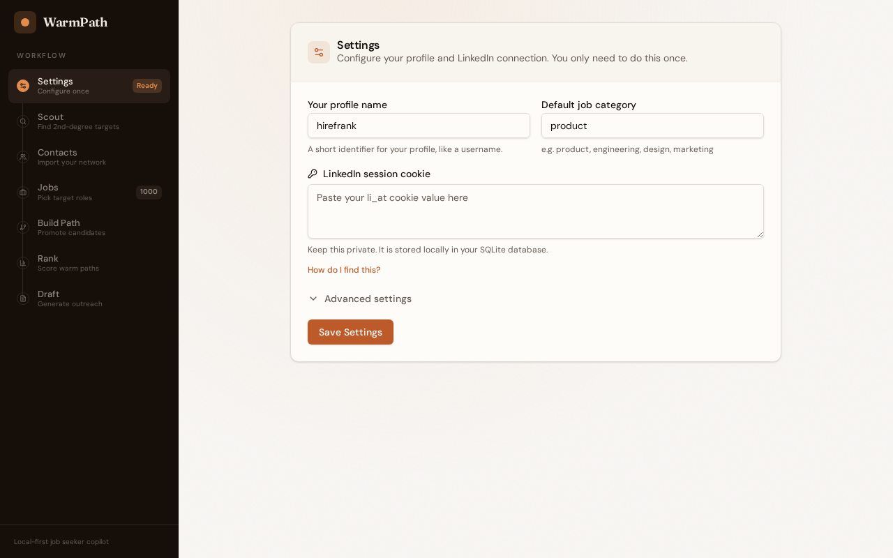

# WarmPath

Find the best warm path into a job, then execute outreach with structure.



## What this is

Job hunting is usually noisy:

- you find a role,
- you guess who to contact,
- you write a message,
- and you lose track of follow-ups.

WarmPath helps you do this in a repeatable way.

You import contacts, choose a job, and WarmPath ranks who in your network is the strongest connector. Then it generates outreach materials, tracks what happened, and learns from outcomes.

Everything runs locally on your machine by default.

## How it works

1. **Scout** possible paths to target companies and roles, including second-degree candidates.
2. **Rank** connectors by weighted signals: company affinity, role relevance, relationship strength, context, and confidence.
3. **Generate** structured outreach assets: briefs, message variants, and distribution artifacts.
4. **Track** workflow status and reminders so outreach does not fall through.
5. **Learn** from outcomes and auto-tune ranking weights over time.

## Key Features

- Reachable-now lane: rank direct warm connectors for selected jobs
- Build-a-path lane: scout second-degree targets and connector paths
- Structured outreach brief generation with trust/safety guardrails
- Message packs with email, DM, and follow-up variants
- Workflow tracking and reminder scheduling
- Learning loop with auto-tuned scoring profile
- Distribution pack export modes:
  - machine-readable JSON bundle
  - markdown playbook
  - CRM-ready note

## Quick Start

### Prerequisites

- [Bun](https://bun.sh)

### Setup

```bash
# 1) install dependencies
bun install

# 2) start API server
bun run dev:server

# 3) start client
bun run dev:client
```

Open:

- App: [http://localhost:5173](http://localhost:5173)
- API health: [http://localhost:3001/api/health](http://localhost:3001/api/health)

### Single-origin mode

If you want one origin for UI and API:

```bash
bun run dev:single-origin
```

Then open [http://localhost:3001](http://localhost:3001).

This builds the client and serves static assets from the Hono server. For fastest UI iteration with HMR, keep using dual-process dev.

### One-command demo

```bash
bun run demo
```

## Setup Details

1. Install Bun.
2. Clone this repo.
3. Run `bun install` from repo root.
4. Start server: `bun run dev:server`.
5. Start client: `bun run dev:client`.
6. Open `http://localhost:5173`.
7. Import LinkedIn contacts CSV.
8. Pick a job, rank paths, and generate outreach assets.

If you only need local/offline behavior, you can run without LinkedIn session config.

## Configuration

### Core

- `WARMPATH_DB_PATH`: override SQLite file path. Default is `warmpath.db` in repo root.

### LinkedIn + Scout

- `LINKEDIN_LI_AT`: LinkedIn session cookie for live 2nd-degree discovery.
- `LINKEDIN_RATE_LIMIT_MS`: default `1200`
- `LINKEDIN_REQUEST_TIMEOUT_MS`: default `15000`
- `SCOUT_MIN_TARGET_CONFIDENCE`: default `0.45`
- `SCOUT_STATIC_TARGETS_JSON`: fallback targets for local/non-LinkedIn scouting.
- `SCOUT_PROVIDER_ORDER`: default `linkedin_li_at,static_seed`

### Scout v2 score weight overrides

- `SCOUT_V2_WEIGHT_COMPANY_ALIGNMENT`
- `SCOUT_V2_WEIGHT_ROLE_ALIGNMENT`
- `SCOUT_V2_WEIGHT_RELATIONSHIP`
- `SCOUT_V2_WEIGHT_CONNECTOR_INFLUENCE`
- `SCOUT_V2_WEIGHT_TARGET_CONFIDENCE`
- `SCOUT_V2_WEIGHT_ASK_FIT`
- `SCOUT_V2_WEIGHT_SAFETY`

Without valid `LINKEDIN_LI_AT`, scout runs still work with seed/static targets and may return `needs_adapter` for live discovery.

## Development Commands

```bash
# single-origin local runtime
bun run dev:single-origin

# type checks
bun run typecheck:server
bun run typecheck:client

# server tests
bun run test:server

# single test file
bun run --cwd apps/server test src/routes/warm-path-runs.route.test.ts

# single test by name
bun run --cwd apps/server test src/routes/warm-path-runs.route.test.ts -t "generates distribution pack artifacts"

# production client build
bun run --cwd apps/client build
```

## API Overview

Warm-path core:

- `POST /api/warm-path/rank`
- `GET /api/warm-path/runs/:id`
- `POST /api/warm-path/runs/:id/outreach-brief`
- `POST /api/warm-path/runs/:id/message-pack`
- `POST /api/warm-path/runs/:id/distribution-pack`
- `POST /api/warm-path/runs/:id/intro-draft`

Workflow + reminders:

- `GET /api/warm-path/runs/:id/workflow`
- `POST /api/warm-path/runs/:id/workflow/track`
- `POST /api/warm-path/runs/:id/reminders`
- `PATCH /api/warm-path/runs/:id/reminders/:reminderId`

Learning loop:

- `GET /api/warm-path/learning/summary`
- `POST /api/warm-path/learning/feedback`
- `POST /api/warm-path/learning/auto-tune`

Scout + jobs + contacts:

- `POST /api/warm-path/jobs/sync`
- `GET /api/warm-path/jobs`
- `POST /api/warm-path/contacts/import`
- `GET /api/warm-path/contacts`
- `POST /api/warm-path/scout/run`
- `GET /api/warm-path/scout/runs`
- `GET /api/warm-path/scout/runs/:id`
- `GET /api/warm-path/scout/stats`

See `docs/release-3-api.md` and `docs/release-notes.md` for details.

## Project Structure

```text
warmpath/
├── apps/
│   ├── server/           # Hono API, repositories, scoring, route tests
│   └── client/           # React UI, sidebar workflow, API wrappers
├── packages/
│   └── shared/           # Cross-app TypeScript contracts
└── docs/                 # Plans, API reference, release notes
```

## Local-First and Safety

- Data is stored in local SQLite by default.
- Draft context guardrails block unsafe instructions.
- Raw emails, phones, and LinkedIn URLs in context are sanitized and surfaced as warnings.

## License

MIT
